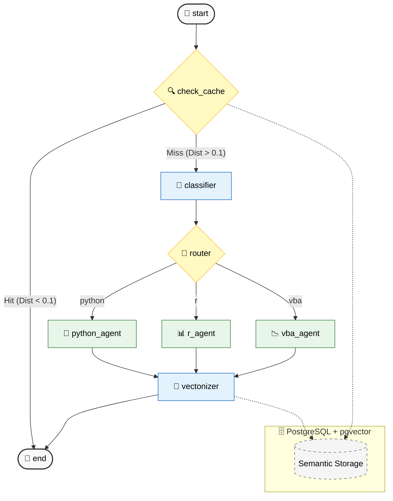

 
## 🚀 Agentic AI Tech Stack Evaluator

This project is a production-oriented agentic workflow that helps companies decide **when to keep legacy VBA solutions and when to migrate to modern Python/R stacks**.

It uses a multi-agent system (built with LangGraph and Azure OpenAI) to:

* analyze business requirements
* classify task complexity
* recommend the optimal technology stack
* generate implementation-ready code

### 🧠 Advanced Architecture: Semantic Cache & Hybrid RAG


    
The system features a Multi-Tier Semantic Memory powered by pgvector in PostgreSQL. This architecture solves the common LLM challenges of high latency and redundant token costs:

Tier 1: Semantic Cache (Distance < 0.1): If a query has >90% similarity with a previously answered question, the system performs a Direct Cache Hit, returning the stored solution instantly without calling the LLM.

Tier 2: Hybrid Context Injection (Distance 0.1 - 0.3): For queries with 70-90% similarity, the system retrieves the historical solution and injects it as Few-Shot Context into the Classifier and Agent nodes. This ensures architectural consistency across similar business requests.

Tier 3: Autonomous Reasoning (Distance > 0.3): Full agentic orchestration for novel problems.

### 💼 Business Value

* Cost Efficiency: Reduces OpenAI token consumption by up to 80% through semantic caching.
* Architectural Consistency: Injected context prevents "model drift" by following established technology patterns.
* Migration Accelerator: Automates the decision-making process for migrating legacy Excel/VBA tools to cloud-ready Python/R solutions.

### 🧠 How it works

An orchestrator agent:

1. Interprets business requirements
2. Routes tasks to specialized agents (VBA / Python / R)
3. Evaluates trade-offs (complexity, scalability, maintainability)
4. Returns a tokens usage + structured recommendation + generated code
---

### ✨ Usage Example
* User Input:
```bash
Please develop a robust, scriptable solution to automate the update of 5,000 Team Leader PowerPoint presentations. The tool should perform headless updates of metrics within text boxes, pie charts, and table heatmaps. To ensure visual consistency, the solution must use a predefined template as a class-based bridge, parsing data directly into existing object placeholders. Please prioritize a solution that leverages high-level automation libraries to ensure maximum processing efficiency and scalability.
```

* AI Agentic Output

--- TOKENS USED BY python agent: 2166 ---

--- STACK: PYTHON ---

Solution: To automate the updates of Team Leader PowerPoint presentations as described, we can leverage the python-pptx library for handling PowerPoint files, as well as the pandas library for data manipulation. Below is a Python script that performs the desired automation:

```Python
import os
import pandas as pd
from pptx import Presentation
from pptx.util import Inches

class PowerPointUpdater:
    def __init__(self, template_path, data_frame):
        self.template_path = template_path
        self.data_frame = data_frame

    def update_presentations(self, presentations_folder):
        for filename in os.listdir(presentations_folder):
            if filename.endswith('.pptx'):
                self.update_presentation(os.path.join(presentations_folder, filename))

    def update_presentation(self, pptx_path):
        print(f'Updating: {pptx_path}')
        prs = Presentation(pptx_path)

        for slide in prs.slides:
            for shape in slide.shapes:
                if shape.has_text_frame:
                    self.replace_text(shape)
                elif shape.has_chart:
                    self.update_chart(shape)
                elif shape.has_table:
                    self.update_table(shape)

        prs.save(pptx_path)

    def replace_text(self, shape):
        for paragraph in shape.text_frame.paragraphs:
            for run in paragraph.runs:
                if run.text in self.data_frame.columns:
                    run.text = str(self.data_frame[run.text].values[0])

    def update_chart(self, shape):
        chart = shape.chart
        # Assuming there is only one series for simplicity
        for series in chart.series:
            series.points[0].data_label.text = str(self.data_frame[series.name].values[0])

    def update_table(self, shape):
        for row_idx, row in enumerate(shape.table.rows):
            for col_idx, cell in enumerate(row.cells):
                try:
                    cell.text = str(self.data_frame.iloc[row_idx, col_idx])
                except IndexError:
                    continue

def main():
    template_path = 'path/to/your/template.pptx'  # Change to your template path
    presentations_folder = 'path/to/presentations/'  # Change to the path with presentations
    data_file = 'path/to/data.csv'  # Change to your data source path (CSV)

    data_frame = pd.read_csv(data_file)
    updater = PowerPointUpdater(template_path, data_frame)
    updater.update_presentations(presentations_folder)

if __name__ == '__main__':
    main()
```

Explanation
Class Definition: PowerPointUpdater encapsulates all the functionality needed to update presentations based on a supplied data frame.

Update Presentations: Loops through all PowerPoint files in a specified folder and updates each one.

Update Presentation: Opens a presentation and iterates through slides and shapes:

Text Updates: Replaces any text found in text boxes with corresponding data from the DataFrame.

Chart Updates: Updates chart data labels based on the DataFrame.

Table Updates: Populates table cells with data from the DataFrame while handling potential index errors.

Main Method: Sets paths for the template, presentations, and data source. Initializes the updater and calls the update process.

Requirements
Install python-pptx and pandas libraries via pip:

```Bash
pip install python-pptx pandas
```

Scaling
This script handles updates efficiently across numerous presentations and can be further optimized or parallelized using multiprocessing if needed for extremely large datasets.

Important Note: Make sure the placeholders (text, charts, and table formats) in the PowerPoint presentations match the expected format as described in the code to ensure successful updates. Adjust the logic in update_chart and update_table as necessary depending on the specific structure of your presentations.

## 🛠 Tech Stack & Engineering Standards
- **Framework:** `LangGraph` (Directed Acyclic Graphs with Cyclic State Management)
- **Validation:** `Pydantic v2` for Strict Structured Output and Type Safety
- **LLM:** `AzureChatOpenAI` (Integrated via **Poland Central** region for minimal latency)
- **Vector Database:** `PostgreSQL` with `pgvector` – Custom-built hybrid storage for persistent semantic memory, featuring HNSW indexing for high-performance      similarity searches.
- **Embeddings:** `AzureOpenAIEmbeddings` (`text-embedding-3-small`) – High-dimensional semantic representation (512-dim) for multi-language query alignment.
- **Containerization:** `Docker` & `Docker Compose` for environment parity.
- **State Management:** `TypedDict` with `Annotated` message history for full traceability.

---

## 🏗 System Architecture (Agentic Design)
The system follows a **Modular Router-Agent Architecture**:

1. **Semantic Classifier (Node):** The entry point that decides between Cache, RAG-injection, or Cold Start.
2. **State-Based Router:** Manages the flow based on semantic distance and classification results.
3. **Specialized Reasoning Engines (Nodes):**
    * **Python Agent:** Optimized for scalable data engineering and ML.
    * **R Agent:** Tailored for advanced statistical modeling and visualization.
    * **VBA Agent:** Focused on MS Office integration and legacy automation.

---

## 🚀 Deployment & Usage

### Running with Docker (Recommended)
This is the fastest way to ensure environment consistency.

1. **Clone Repository**
    
     ```Bash
    git clone [https://github.com/aleksanderwasilewski1310/agentic_ai_tech_stack_evaluator.git](https://github.com/aleksanderwasilewski1310/agentic_ai_tech_stack_evaluator.git)
    cd agentic_ai_tech_stack_evaluator
    ```

1. **Environment Configuration:**

    Create a .env file with your Azure credentials:

    ```Code
    AZURE_OPENAI_ENDPOINT="your-endpoint"
    AZURE_OPENAI_DEPLOYMENT_NAME="your-deployment"
    AZURE_OPENAI_API_KEY="your-key"
    OPENAI_API_VERSION="2024-08-01-preview"
    ```

2. **Build the image:**
   ```bash
   docker compose up --build
    ```
   
3. **Detach by typing "D".**
   
4. **Run the interactive agent:**

    ```Bash
    docker attach agentic_ai_tech_stack_evaluator-server-1
    ```

### Local Installation

1. **Clone & Install requirements:**

    ```Bash
    git clone [https://github.com/aleksanderwasilewski1310/agentic_ai_tech_stack_evaluator.git](https://github.com/aleksanderwasilewski1310/agentic_ai_tech_stack_evaluator.git)
    cd agentic_ai_tech_stack_evaluator
    pip install -r requirements.txt
    ```

2. **Environment Configuration:**

    Create a .env file with your Azure credentials:

    ```Code
    AZURE_OPENAI_ENDPOINT="your-endpoint"
    AZURE_OPENAI_DEPLOYMENT_NAME="your-deployment"
    AZURE_OPENAI_API_KEY="your-key"
    EMBEDDING_DEPLOYMENT_NAME="your_embedding_deployment_name"
    EMBEDDING_API_VERSION="your_embedding_api_version"
    OPENAI_API_VERSION="your_open_ai_api_version"
    ```

3. **Run the application:**
    ```Bash
    python main.py
    ```

## 🚦 Key Senior-Level Features

Semantic Cache Logic: Custom SQL implementation using (azure_embedding <=> %s::vector) for high-performance distance calculation.

Dynamic State Management: Using TypedDict and Annotated to track message history and cross-node context.

Environment Parity: Multi-container setup (App + DB) ensures the system works identically in dev, staging, and production.

### 📈 Future Roadmap

[ ] LangSmith Integration: Trace monitoring and latency tracking for enterprise-scale auditing.

[ ] Groundedness Checks: Automated validation to prevent hallucinations in generated code snippets.

[ ] Cloud-Native Deployment: Transitioning to Azure Container Instances (ACI).

### Author: Aleksander Wasilewski
